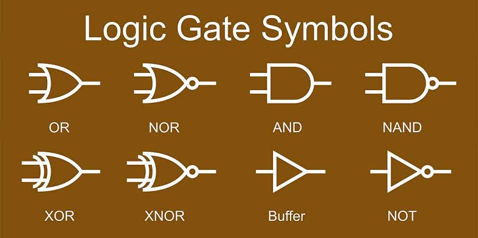
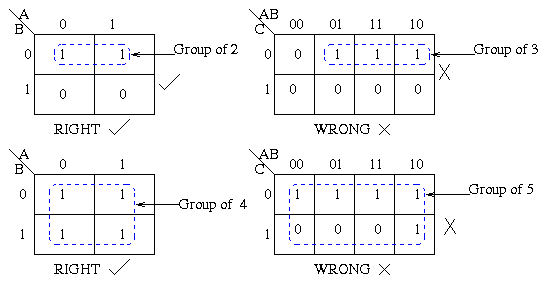

Feedback Nov 26 (You can deleted this section later. It will remain in the history of the file)

|No.|How to improve        |
|-|------------- |
|①| I can understand what you are trying to say with definition of the problem and the proposed solution, however, you need to expand the ideas a bit more. Add details. Some questions that will help you write these two sections: 1. Who is your client? what is the problem? what tools will you used in the proposed solution? why those tools and no other?| 
|②| Let's try to include at least 5 success criteria afther the proposed solution. They can be small such as: The system uses 100W lights for communication. You will measure your solution againts these criteria.|
|③| Great job with the Development section and documentating your progress. Keep adding pictures, small parts of code, sketches, flow diagrams. In addition to writing what the program does, for example: "this is a program that prints all Odd and Even numbers from 1 to 1000. ", you can mention important parts of the code where you learnt something new. |

**For example**
Fig. 2 shows the program that prints all Odd numbers from 1 to 1000. This is accomplished by changing the increment in the for loop to be 2.
```.c
for (int x = 1; x < 1001; x+=2) {
  Serial.println("even numbers are"); 
  Serial.println(result+x);   
  }
```

|No.|How to improve        |
|-|------------- |
|④　|Add your References at the bottom of the page using MLA format. I have added the section for you to fill in.|

----

# Binary-Morse program | Unit2-HasanMajdi-


Binary-Morse program 
===========================
A program to transfer understandable messages using two buttons from earth to mars crossing by the moon. 

Contents
---------
  1. [Planning](#planning)
  1. [SolutionOverview](#SolutionOverview)
  1. [Development](#development)
  1. [Evalution](#evaluation)
  1. [improvements](#improvements)
  
  Planning
----------
### Definition of the problem 
we are in the year 2050, people are travelling around the universe and we have a problem transfering messages between astroununts, it is a really important thing to have a good tool to communicate with others. so here we are working on arduino to build a stations that transfer understandable messages from earth to moon in Morse code then sending from moon to mars using binary code, using simple two arduino buttons method, the messeges should be understandable the same way on the three stations.

### Solution proposed
so we are using arduino to build a three stations, in three buildings, each building represent a planet (earth - moon - mars) 
then sending messages from/to these stations, why arduino? because arduino is simple to use, cheab, and avaliable for us, it provides us with what we need to complet this project.

### Success criteria 
1. Messages should be transfered from/to each station(planet).
2. The system uses 100W lights for communication.
3. The system uses two buttons only to write the messages. 
4. LCD screen is there to show the messages.
5. The system allows the clients to use all English letters, all numbers, and SEND, DELETE, and SPACE are existed options
6. The system is simple to use and considering Usability.

Development
-----------
 
 ### Arduino 
 Arduino is an open-source software and hardware development board that can be used by tinkerers, and makers to design and build devices/circuits, Arduino codes are run machine code compiled from either C, C++ or any other language that has a compiler for the Arduino instruction set we 
 
 ### Serial Mentor 
 It is the screen where you see the output of the code you wrote.
 
 ***Arduino Codes Content***
  
 1.```
 void setup()
{
}
 .```
this part will run only once. 

2.```
void loop()
{
}
.```
this part of the code will loop, which means everything you put inside will be repeated. 

the variable ```void``` indicates that the function is expected to return no information to the function from which it was called.

3.```Functions``` are blocks of organized, reusable code that is used to perform related action again, which means they are used to avoid repetition of the commands in a code. 
 
*Example of the use of functions

```.C
// this is an example of using functions 

int redLED = 13; 
  int greenLED = 12;
  int orangeLED = 11;
	int whiteLED = 9; 
	int blueLED = 8;
	int yellowLED = 7;


void setup()
{
  pinMode(redLED, OUTPUT);
  pinMode(greenLED, OUTPUT);
  pinMode(yellowLED, OUTPUT); 
  pinMode(orangeLED, OUTPUT);
  pinMode(whiteLED, OUTPUT);
  pinMode(blueLED, OUTPUT);
}

void loop()
{
  blink(1000, redLED);
  blink(1000, greenLED);
  blink(1000, yellowLED);
  blink(1000, whiteLED);
  blink(1000, blueLED);
  blink(1000, orangeLED);
  
}
// this function blinks a LED
// only argument is the time 
void blink(int time, int port){
  digitalWrite(port, HIGH);
  delay(time); // Wait for 1000 millisecond(s)
  digitalWrite(port, LOW);
  delay(time); // Wait for 1000 millisecond(s)
}
```

### Practicing coding with modern C

**OddEven**

this is a program that prints all Odd and Even numbers from 1 to 1000. 

```.C 
int result = 0;
int odd = 0;

void setup()
{
 Serial.begin(9600);
}

void loop()
{
  for (int x = 1; x < 1001; x+=2) {
  Serial.println("even numbers are"); 
  Serial.println(result+x); 
   
  }
    
    for (int i = 2; i < 1001; i+=2) {
  Serial.println("odd numbers are"); 
  Serial.println(odd+i);  
		}
}
```
**Sequence**

This is a program that prints a sequence of numbers from 0 to 6 repeatedly.
```.C
char *myStrings[] = {"0123456" };

void setup()
{ 
  Serial.begin(9600);
}

void loop()
{
for (int i = 0; i < 1; i++) {
    Serial.println(myStrings[i]);
    delay(10);
}
}
```
**7Factors**

this program prints the factors of number 7 from 7 to 700. 
```.C 
void setup()
{
  Serial.begin(9600);
}

void loop()
{
 for (int i = 0; i < 707; i+=7) { 
   Serial.println(i);
}
 	}
```
**Greetings**

This program prints greetings in Arabic/Turkish.
```.C
char *myStrings[] = {"Merhaba"};

void setup() {
  Serial.begin(9600);
}

void loop() {
  for (int i = 0; i < 1; i++) {
    Serial.println(myStrings[i]);
  }
}
```

**Traffic Light** 

This is a Traffic Light created by ThinkerCard, then built in class by Arduino. 


In class using Arduino Kit.


*Code*

```.C
void setup()
{
  pinMode(13, OUTPUT);
  pinMode(10, OUTPUT);
  pinMode(8 , OUTPUT);
}

void loop()
{
  digitalWrite(10, HIGH);
  delay(1000); // Wait for 1000 millisecond(s)
  digitalWrite(10, LOW);
  delay(100); // Wait for 1000 millisecond(s)
  
  digitalWrite(13, HIGH);
  delay(1160); // Wait for 1000 millisecond(s)
  digitalWrite(13, LOW);
  delay(100); // Wait for 1000 millisecond(s)
  
  digitalWrite(8, HIGH);
  delay(5000); // Wait for 1000 millisecond(s)
  digitalWrite(8, LOW);
  delay(1000); // Wait for 1000 millisecond(s)
  
} 
```
 
**Counter In Arduino**

This program creates a binary counter from 0 to 31 with arduino using LED lights. 

**Flow Diagram**


**How to convert from decimal to binary**

1. Divide the dividend (number) by divisor 2 and get the remainder and the quotient.
2. If the remainder is not zero then becomes dividend and follow above steps. 
3. As the quotient has become zero, the binary is all the remainders from bottom or from right side which consists of 0 & 1.

**Using Modulo** 
Finding the remainder of division of one number by another. 
For example: ```a % n = r ```. ``` 5 % 2 = 1 ``` because there are two pairs and only one left.

If n = 0 the equation may return undefined.

The result is always a whole integer.

If n is greater than a the result is a. 

**code for the counter**
```.C
int ledPin[] = {13,12,11,10,9,8};
// an arry to de
fine the pins

void setup()
{
  for (int i = 0; i < 6; i++)
  {
    pinMode(ledPin[i], OUTPUT);
  }
}

void loop()
{
  for (byte counter = 0; counter <= 32; counter++)
  {
    displayBinary(counter);
    delay(2000);
  }
}

void displayBinary(byte num)
{
  for (int i = 0; i < 6; i++)
  {
    if (bitRead(num, i)==1)
    {
      digitalWrite(ledPin[i], HIGH);
    }
    else
    {
      digitalWrite(ledPin[i], LOW);
    }
  }

}
```
**Counter in class with arduino**


### Logic Gates, K-Map Tables and Logical Equations


Logic gates are the basic building blocks of any digital system. It is an electronic circuit having one or more than one input and only one output. The relationship between the input and the output is based on a certain logic. Based on this, logic gates are named as AND gate, OR gate, NOT gate XOR gate or so.

**K-Map Tables**

The Karnaugh map is a method of simplifying Boolean algebra expressions.


Equations for outputs B and C from this table.


We are using this method to decrease the amount of time and effort spent on the code. 

(   bool equa = b || (!a && !a && !c) || (a && c);
    digitalWrite(outa, equa);    )
    
    for example the code here is the equation we got from the truth tables we did in the class. 
    
   
   **Using LCD Screen**
   
   using LCD screen is really important for this project, because it is part of the sccess criteria to include it. also because we want the client to be comfortable using the project. 
   
   


**What is Usability?**

It is part of user experience. 
Process of designing a product with users preferences in mind. 
degree of ease that a product can be used to attain the proposed goal.

**Refrence**
international design fundation "Usability". 25 Nov, 2019


